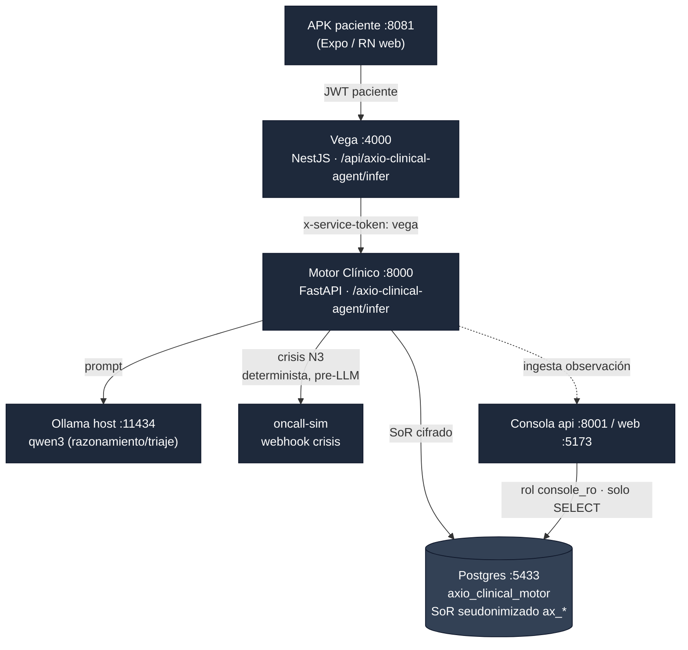

<div align="center">

# AXIO Clinical

**On-premise clinical intelligence for decision support, triage and symptom analysis.**

Motor de inteligencia clínica **local-first** para clínicas y hospitales: soporte a la decisión,
triaje y análisis de síntomas — con **PHI hardening**, manejo **determinista de crisis** y
**audit log append-only**.


-475569)


</div>

---

> **Repo umbrella (privado).** Este repositorio es la **fuente única de verdad de la arquitectura,
> el despliegue y la operación** de AXIO Clinical. No contiene el código de los componentes (viven
> en sus propios repos / carpetas locales — ver [`components.md`](components.md)); reúne la
> documentación integral, los diagramas y el **orquestador de despliegue** ([`orchestration/`](orchestration/)).

## ¿Qué es?

AXIO Clinical es el **Clinical Engine** de AXIO: un asistente clínico que corre **dentro de la
infraestructura de la clínica** (on-premise), sin enviar datos de pacientes a la nube. Atiende al
paciente por app/web, razona con un **LLM local** (Ollama / qwen3), clasifica el riesgo en una
escala canónica **N0–N3**, y ante una crisis (**N3**) escala de forma **determinista** — antes de
tocar el LLM — a un flujo humano con notificación en <2 min.

Cada dato clínico se guarda seudonimizado en un **System of Record (SoR)** cifrado; la identidad
directa vive separada y cifrada. La **consola** da a los equipos clínicos observabilidad, HITL
(human-in-the-loop) y gates *fail-closed*, con acceso de **solo lectura** al SoR.

Modelo de negocio/despliegue: **single-tenant, una instancia por clínica**. Para una clínica nueva
se replica el stack con su propio `.env`, sus modelos y su branding.

## Componentes

| Servicio | Rol | Stack | Puerto | Repo/carpeta |
|---|---|---|---|---|
| **Vega** (backend paciente) | API paciente, JWT, proxy al agente | NestJS | `:4000` | `axio-clinical-platform-vega/backend` |
| **APK paciente** | App del paciente (web/RN) | Expo / React Native | `:8081` | `axio-clinical-platform-vega/mobile` |
| **Admin** | Operación / back-office | Next.js | (config) | `axio-clinical-platform-vega/admin` |
| **Motor Clínico** | Razonamiento, triaje N0–N3, crisis, SoR | Python / FastAPI | `:8000` | `axio-clinical-motor-clinico` |
| **Consola** | Observabilidad, HITL, gates, precios | Python + Vite/React | api `:8001`, web `:5173` | `axio-clinical-console` |
| **Orquestación** | Compose: motor+consola+postgres+oncall-sim | Docker Compose | postgres `:5433` | [`orchestration/`](orchestration/) |
| **Web (demo)** | Demo web del agente | Vite/React | — | `axio-clinical-web` |
| **Siku** | Conector IoLab/Siku | Python | — | `axio-clinical-siku` |
| **ContactShip** | Puente voz/omnicanal | Python | — | `axio-clinical-contactship` |
| **LLM** | Inferencia local | **Ollama en el host** | `:11434` | (host, fuera de Docker) |

> Codenames internos conservados (no son marca): `vega`, `motor`, `consola`, `siku`.
> Ver estado de publicación de cada repo en [`components.md`](components.md).

## Arquitectura (flujo E2E)



Detalle completo en [`docs/architecture.md`](docs/architecture.md). Fuente Mermaid en
[`docs/diagrams/architecture.mmd`](docs/diagrams/architecture.mmd).

## Escala de riesgo N0–N3

| Nivel | Uso | Regla |
|---|---|---|
| **N0** | Informativo / administrativo | Beneficios, citas, información general. No diagnostica. |
| **N1** | Preventivo / no urgente | Orientación y autocuidado seguro + disclaimer. |
| **N2** | Monitoreo / criterio clínico | Recomienda seguimiento clínico; valida contra SoR/KB. |
| **N3** | **Escalación / crisis** | Bandera roja: escala y notifica <2 min. Corta **antes** del LLM. |

Contrato de la API de inferencia: [`docs/api-infer.md`](docs/api-infer.md).

## Quickstart (despliegue local de una clínica)

Requisitos: **Docker Desktop**, **Ollama en el host** (GPU) con `qwen3:8b` (o `qwen3:14b`) y
`nomic-embed-text`, **Node 20+**.

```bash
# 1) Core: motor + consola + Postgres + oncall-sim
cd orchestration
cp .env.example .env           # completar secretos (ver docs/deployment.md)
docker compose up -d --build
docker compose ps              # 5 servicios, 4 healthy
./scripts/smoke.sh             # turno normal + crisis N3 contra Ollama real

# 2) Vega (backend paciente) + APK web  (desde su repo/carpeta)
npm --prefix ../../axio-clinical-platform-vega/backend install
npm --prefix ../../axio-clinical-platform-vega/backend run start:dev   # :4000
# APK Expo web (:8081): en mobile/ → npx expo start --web
```

Guía paso a paso y **checklist de clínica nueva** en [`docs/deployment.md`](docs/deployment.md).

## Seguridad y PHI

- **De-identificación Safe-Harbor**: los identificadores directos no viajan ni se registran en claro.
- **Seudónimo de sujeto** `ax_<id>`; identidad directa cifrada y separada (`AXIO_CLINICAL_IDENTITY_KEY`).
- **Crisis N3 determinista**: la escalación no depende del LLM; corta antes de inferir.
- **Audit log append-only** y gates **fail-closed** en la consola.
- **Auth servicio-a-servicio** por `x-service-token`; consola lee el SoR con rol `console_ro` (solo SELECT).
- **Sin secretos en el repo**: todo secreto vive en `.env` por instancia (ver [`.env.example`](.env.example)).

Detalle y divulgación responsable en [`SECURITY.md`](SECURITY.md) y [`docs/security-phi.md`](docs/security-phi.md).

## Documentación

| Doc | Contenido |
|---|---|
| [`docs/architecture.md`](docs/architecture.md) | Componentes, puertos, flujo E2E, SoR, agente, LLM local |
| [`docs/deployment.md`](docs/deployment.md) | Despliegue single-tenant + checklist de clínica nueva |
| [`docs/integration.md`](docs/integration.md) | Naming AXIO, auth, config, puntos de integración |
| [`docs/security-phi.md`](docs/security-phi.md) | PHI, Safe-Harbor, crisis N3, audit, roles |
| [`docs/api-infer.md`](docs/api-infer.md) | Contrato `POST /infer` (request/response, N0–N3) |
| [`docs/branding.md`](docs/branding.md) | Tema visual AXIO (navy + steel) |
| [`components.md`](components.md) | Mapa de componentes → repos y estado |
| [`CONTRIBUTING.md`](CONTRIBUTING.md) | Convenciones y flujo de trabajo |

## Estado

MVP **end-to-end funcional** en local (turno normal + crisis N3 verificados contra Ollama real).
Modelo de despliegue **single-tenant replicable** confirmado; multi-tenant no implementado.

---

<div align="center">
<sub>AXIO · Clinical Engine — <a href="https://www.axiostaging.com/services/clinical-engine/">axiostaging.com/services/clinical-engine</a> · Repo privado — © AXIO. Todos los derechos reservados.</sub>
</div>
